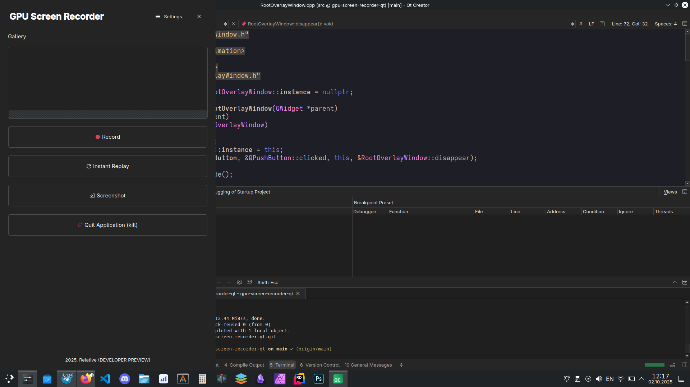

# GPU Screen Recorder Qt Overlay

A sidebar overlay UI for [GPU Screen Recorder](https://git.dec05eba.com/gpu-screen-recorder/about/) in the style of NVIDIA App.\
The application is currently primarly designed for Wayland and can't be run on X11 (yet).




# Technologies
- Qt 6
- KDE's LayerShellQt
- [GPU Screen Recorder CLI](https://git.dec05eba.com/gpu-screen-recorder/) (version 5.0.0 or later)


# Building
Use CMake to build this project:

```bash
mkdir build && cd build
cmake ..
cmake --build .
```
